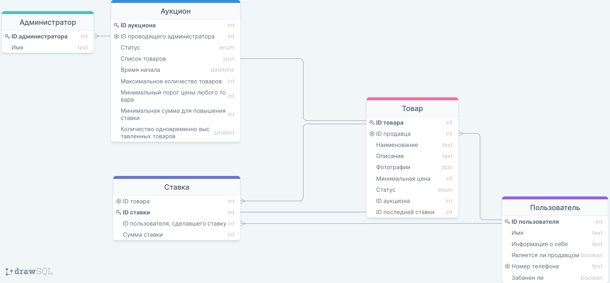

# Задание 1

## Список функциональных требований для проекта
* Должен быть разработан веб-сайт для онлайн-аукциона, на котором должны быть страницы:
  * Страница регистрации пользователя.
  * Страница авторизации пользователя.
  * Страница отображения профиля пользователя.
  * Страница редактирования профиля пользователя.
  * Страница отображения товара.
  * Страница редактирования товара.
  * Страница анонса аукциона.
  * Страница проведения аукциона.
  * Страница редактирования аукциона.
  * Страница ленты аукционов с товарами.
  * Страница авторизации администратора.
  * Страница отображения профиля администратора.
  * Страница чата между пользователем-покупателем, пользователем-продавцом и связующем их администратором.

* Товар должен включать в себя:
  * Уникальный идентификатор (ID) товара.
  * Уникальный идентификатор (ID) продавца.
  * Наименование.
  * Описание.
  * Фотографии.
  * Минимальная цена.
  * Статус: пока не продаётся, на торгах, представлен к оплате, доставляется, продан.
  * Уникальный идентификатор (ID) аукциона.
  * Уникальный идентификатор (ID) последней ставки.

* Аукцион должен включать в себя:
  * Уникальный идентификатор (ID) аукциона.
  * Уникальный идентификатор (ID) проводящего администратора.
  * Статус: запланирован, идёт, завершён.
  * Название.  
  * Упорядоченный список товаров.
  * Время начала аукциона.
  * Максимальное количество товаров.
  * Минимальный порог цены любого товара.
  * Минимальная сумма для повышения ставки.
  * Максимальное время ожидания следующей ставки.
  * Количество одновременно выставленных товаров.

* Ставка должна включать в себя:
  * Уникальный идентификатор (ID) товара.
  * Уникальный идентификатор (ID) пользователя, сделавшего ставку.
  * Уникальный идентификатор (ID) ставки.
  * Сумма ставки.
* Сумма ставки на аукционе должна:
  * Быть не меньше минимальной цены на товар.
  * Быть больше предыдущей ставки минимум на минимальную сумму для повышения ставки на аукционе.

* На странице анонса аукциона должны отображаться уже добавленные в него товары, название аукциона, время начала аукциона, максимальное количество товаров, минимальный порог цены любого товара, минимальная сумма для повышения ставки, максимальное время ожидания следующей ставки, количество одновременно выставленных товаров, проводящий администратор.

* Во время аукциона на странице проведения аукциона должно быть:
  * Информация о текущих выставленных товарах вместе с текущими ставками.
  * Чат посетителей аукциона.
  * Кнопка сделать ставку при каждом товаре.
* Товары на аукционе выставляются по порядку из списка товаров аукционов.
* Если прошло максимальное время ожидания следующей ставки и ставка не была сделана, то товар предоставляется к оплате пользователю, сделавшему последнюю ставку.

* Регистрация пользователя происходит по номеру мобильного телефона.
* Авторизация пользователя.

* Профиль пользователя должен включать:
  * Уникальный идентификатор (ID) пользователя. 
  * Имя пользователя.
  * Информация "о себе", заполняемая пользователем.
  * Является ли пользователь продавцом.
    * Если пользователь - продавец, то в профиле должен быть список его товаров.
  * Забанен ли.

* Пользователь должен иметь возможность:
  * Редактировать информацию своего профиля.
  * Стать продавцом.
  * Сделать ставку на товар на аукционе
    * Со своей суммой, удовлетворяющей требованиям аукциона.
    * С суммой, равной сумме предыдущей ставки плюс минимальная сумма для повышения ставки.
  * Связаться с продавцом выигранного товара.
  * Оплатить товар по выигранной ставке на счёт онлайн-аукциона.
  * Подтвердить доставку товара.
 
* Продавец должен иметь возможность:
  * Создать товар.
  * Удалить товар, если он ещё не оплачен.
  * Редактировать информацию о товаре, если товар не выставлен на аукцион.
  * Назначить минимальную цену товара.
  * Выставить товар на аукцион. Товар может находиться одновременно только на одном аукционе.
  * Связаться с пользователем-покупателем, выигравшим ставку по товару.
  * Получить оплату товара со счёта онлайн-аукциона после подтверждения покупателем доставки товара.

* Авторизация администратора.
* Профиль администратора должен включать:
  * Уникальный идентификатор (ID) администратора. 
  * Имя администратора.
  * Список проведённых им аукционов.

* Администратор должен иметь возможность:
  * Создать аукцион.
  * Удалить неначавшийся аукцион.
  * До начала аукциона администор может:
    * Назначить время аукциона.
    * Назначить максимальное количество товаров на аукционе.
    * Назначить минимальный порог цены товаров на аукционе.
    * Назначить минимальную сумму увеличения ставки на аукционе.
    * Назначить максимальное время ожидания следующей ставки на аукционе.
    * Принять/отклонить запрос продавца на выставление товара на аукционе.
    * Редактировать порядок товаров на аукционе.
    * Редактировать название аукциона.
    * Определить количество одновременно выставленных товаров на аукционе (от 1 до 6).
  * Банить пользователей за нарушение политики онлайн-аукциона.
  * Удалить товар, нарушающий политику онлайн-аукциона.

Таким образом роли в онлайн-аукционе: продавец, покупатель, администратор.
Объекты: пользователь, товар, ставка, аукцион, администратор.
//Кстати говоря, по идее администратор получает какой-то процент прибыли продавца.

## Схема объектной модели

[Ссылка на схему](https://drawsql.app/hse-4/diagrams/aukcion#)
